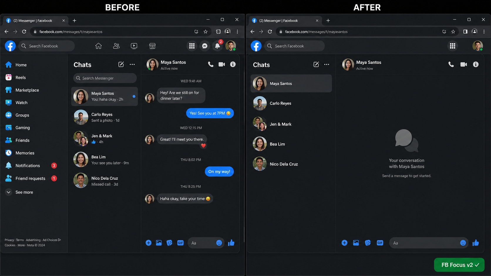
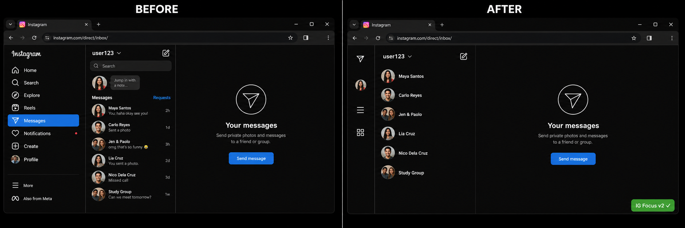

# 🎯 Focus Userscripts

**Strip Facebook & Instagram down to just messages.** No feed. No reels. No marketplace. No distractions. Just conversations.

## 📸 Before & After

### Facebook

### Instagram

## ✨ What it does

- 🚀 **Auto-redirects** to your messages when you open FB or IG
- 🙈 **Hides everything** — feed, reels, marketplace, stories, explore, notifications
- 💬 **Clean chat list** — read threads show only avatar + name, no preview clutter
- 🆕 **New messages stay visible** — unread threads show the full preview so you don't miss anything
- 🎬 **Reel trap protection** — if someone sends you a reel, scrolling instantly closes it (watch once, move on)
- 📱 **Sidebar stays collapsed** on IG (icons only, no text labels)

## 📥 Install

1. Install [Violentmonkey](https://violentmonkey.github.io/) (recommended) or [Tampermonkey](https://www.tampermonkey.net/)
   > ⚠️ **Brave users**: use Violentmonkey — Tampermonkey doesn't work on Facebook in Brave
2. Click to install:
   - **[📘 Facebook Focus](https://raw.githubusercontent.com/ElSigmaTom/focus-userscripts/main/fb-focus.user.js)**
   - **[📷 Instagram Focus](https://raw.githubusercontent.com/ElSigmaTom/focus-userscripts/main/ig-focus.user.js)**
3. Refresh Facebook / Instagram. Done! ✅

You'll see a small green **"FB Focus v2 ✓"** or **"IG Focus v2 ✓"** badge in the bottom-right corner when it's active.

## 🤔 Something not hidden?

FB and IG change their code often. If something slips through:

1. Open DevTools (F12) → Console → look for `[FB-FOCUS]` or `[IG-FOCUS]` logs
2. [Open an issue](https://github.com/ElSigmaTom/focus-userscripts/issues) with a screenshot

## 📄 License

MIT — do whatever you want with it.
